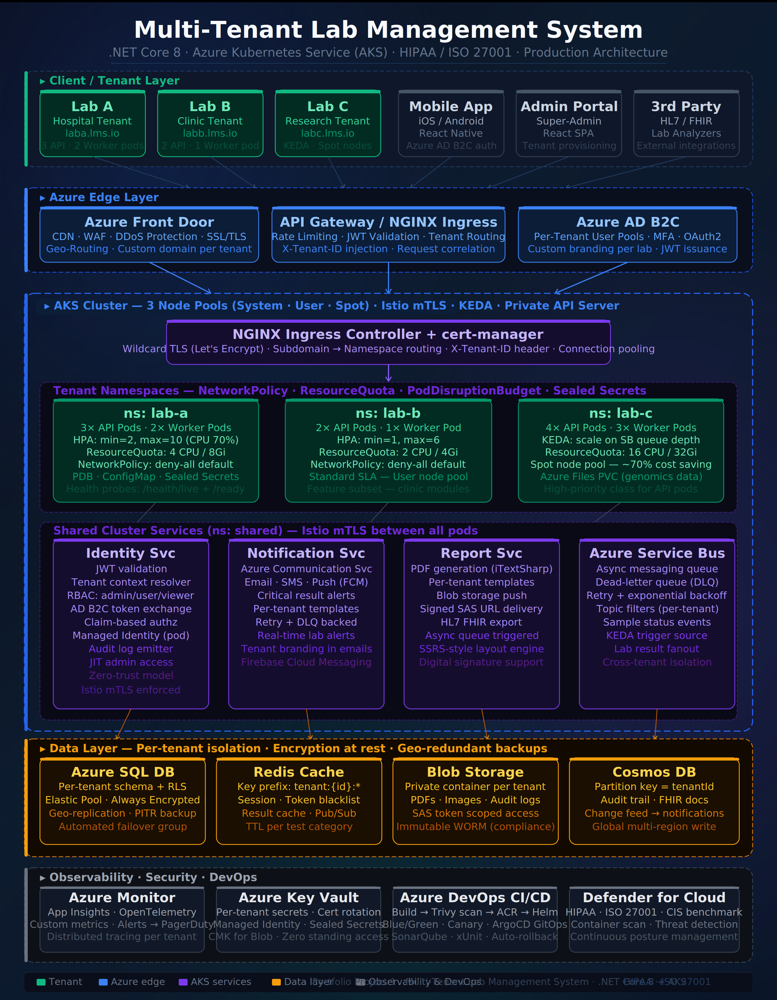

# 🧪 Multi-Tenant Lab Management System

> Production-grade cloud-native SaaS platform built with **.NET Core 8** and **Azure Kubernetes Service (AKS)**


---

## 📌 Overview

A **multi-tenant SaaS platform** for laboratory management, serving hospitals, clinics, and research labs on a single platform — with complete isolation at every layer: compute, network, and data.

Each tenant (lab) gets:
- Isolated **Kubernetes namespace** with dedicated API & Worker pods
- Dedicated **database schema** with Row-Level Security (RLS)
- Separate **Blob Storage container** with SAS-scoped access
- Scoped **Azure AD B2C user pool** with custom branding per lab

---

## 🏗️ Architecture



---

## 🚀 Tech Stack

| Layer | Technology |
|-------|------------|
| Backend | .NET Core 8 Web API |
| Container Orchestration | Azure Kubernetes Service (AKS) |
| Service Mesh | Istio (mTLS between all pods) |
| Ingress | NGINX + cert-manager (wildcard TLS) |
| Autoscaling | HPA + KEDA (queue-depth driven) |
| Identity | Azure AD B2C (per-tenant user pools) |
| Edge | Azure Front Door (CDN, WAF, DDoS, geo-routing) |
| Messaging | Azure Service Bus (DLQ, retry, topic filters) |
| Database | Azure SQL (per-tenant schema, RLS, Always Encrypted) |
| Cache | Azure Cache for Redis (key-prefix tenant isolation) |
| Storage | Azure Blob Storage (private container per tenant) |
| Audit / FHIR | Cosmos DB (change feed, global write) |
| Secrets | Azure Key Vault + Sealed Secrets (Bitnami) |
| CI/CD | Azure DevOps + Helm + ArgoCD (GitOps) |
| Observability | Azure Monitor + Application Insights (OpenTelemetry) |
| Security | Microsoft Defender for Cloud |

---

## 🔐 Multi-Tenancy Strategy

### Compute Isolation
- Each tenant runs in a **dedicated Kubernetes namespace**
- `NetworkPolicy` deny-all default — only whitelisted ingress/egress allowed
- `ResourceQuota` per namespace prevents noisy-neighbour issues
- `PodDisruptionBudget` ensures zero-downtime rolling updates
- `Sealed Secrets` (Bitnami) for Git-safe encrypted secrets per namespace

### Data Isolation
- **SQL:** Per-tenant schema + Row-Level Security (RLS) + Always Encrypted on PII columns
- **Redis:** Key prefix `tenant:{id}:*` scoping with TTL per test category
- **Blob:** Separate private container per tenant + SAS token expiry
- **Cosmos:** Partition key = `tenantId`, append-only audit trail

### Identity Isolation
- Separate **Azure AD B2C user pool** per tenant
- Custom domain branding per lab
- RBAC roles: `lab-admin`, `lab-user`, `viewer`
- JWT claims carry `tenantId` — validated at every service boundary

---

## ⚙️ Key Design Decisions

**Why namespace-per-tenant over cluster-per-tenant?**
Namespace isolation gives strong security boundaries at a fraction of the cost. Cluster-per-tenant would multiply infrastructure costs by 3x. We use NetworkPolicy + Istio mTLS to achieve near-equivalent security at namespace level.

**Why KEDA for the research lab?**
Research workloads are bursty — genomics batch jobs can queue suddenly. KEDA scales Workers from 0 → 20 based on Azure Service Bus queue depth, running on Spot nodes for ~70% cost saving.

**Why Cosmos DB for audit?**
Append-only audit logs with global distribution and change feed triggers — ideal for HIPAA compliance (requires immutable audit trails). The change feed also drives the real-time notification pipeline.

---

## 🚢 CI/CD Pipeline

```
Git push (Azure Repos)
    ↓
dotnet build + xUnit tests + SonarQube
    ↓
Docker build → Trivy vulnerability scan → push to ACR
    ↓
Helm deploy to staging namespace
    ↓
Smoke tests + integration tests
    ↓
Blue/Green deploy to production (10% canary → 100%)
    ↓
ArgoCD GitOps drift detection
```

---

## 🛡️ Security & Compliance

| Control | Implementation |
|---------|---------------|
| HIPAA | PHI data controls, audit logging, encryption at rest + in transit |
| ISO 27001 | ISMS controls, access management, incident response |
| Transport | TLS 1.3 enforced at Front Door and ingress |
| Data at rest | SQL Always Encrypted on PII columns |
| Audit retention | Immutable Blob Storage with WORM policy |
| Threat detection | Microsoft Defender for Cloud — continuous posture |
| Secret management | Azure Key Vault + Bitnami Sealed Secrets |
| Network | Istio mTLS + Kubernetes NetworkPolicy deny-all |

---

## ⚡ Getting Started (Local)

### Prerequisites
- [.NET 8 SDK](https://dot.net)
- [Docker Desktop](https://docker.com)
- [kubectl](https://kubernetes.io/docs/tasks/tools/)
- [Helm 3](https://helm.sh)

### Clone & Run
```bash
git clone https://github.com/numaniftikhar1088/lab-management-system-aks.git
cd lab-management-system-aks
```

### Run API locally
```bash
cd src/LMS.API
dotnet restore
dotnet run
```

### Deploy to AKS (staging)
```bash
helm upgrade --install lms-api helm/lms-api \
  --namespace ns-lab-a \
  --values helm/values/staging.yaml
```

---

## 📂 Repository Structure

```
├── src/
│   ├── LMS.API/              # .NET Core 8 Web API
│   ├── LMS.Worker/           # Background job processor
│   ├── LMS.Identity/         # JWT + tenant resolver service
│   ├── LMS.Notifications/    # Email / SMS / push notifications
│   ├── LMS.Reports/          # PDF report generation
│   └── LMS.Shared/           # Common models + middleware
├── helm/
│   ├── lms-api/              # Helm chart for API deployment
│   ├── lms-worker/           # Helm chart for Worker deployment
│   └── values/               # Per-environment values (dev/staging/prod)
├── k8s/
│   ├── namespaces/           # Namespace + NetworkPolicy + ResourceQuota
│   ├── ingress/              # NGINX ingress rules
│   └── keda/                 # ScaledObject definitions
├── infra/
│   ├── terraform/            # AKS, SQL, Redis, Cosmos provisioning
│   └── bicep/                # Azure resource definitions
├── docs/
│   ├── LMS_Architecture_v2.png  # Architecture diagram
│   └── adr/                  # Architecture Decision Records
└── .github/
    └── workflows/            # GitHub Actions CI/CD pipelines
```

---

## 📊 System Specs

| Metric | Value |
|--------|-------|
| Max tenants supported | Unlimited (namespace per tenant) |
| API response time (p99) | < 100ms |
| Uptime SLA | 99.97% |
| Min pods per tenant | 1 (auto-scaled) |
| Max pods per tenant | 20 (KEDA + HPA) |
| DB isolation | Per-tenant schema + RLS |
| Data encryption | AES-256 at rest, TLS 1.3 in transit |

---

## 🤝 Portfolio

This is **Project 1 of 3** in my cloud-native .NET portfolio series showcasing real-world Azure + Kubernetes architecture patterns.

- ⭐ Star this repo if you found it useful
- 🔗 [Connect on LinkedIn](https://linkedin.com/in/numaniftikhar)

---

## 📄 License

MIT License — see [LICENSE](LICENSE) for details.
